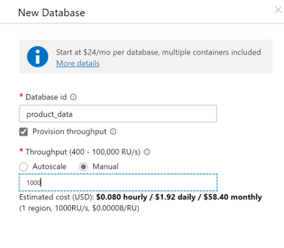
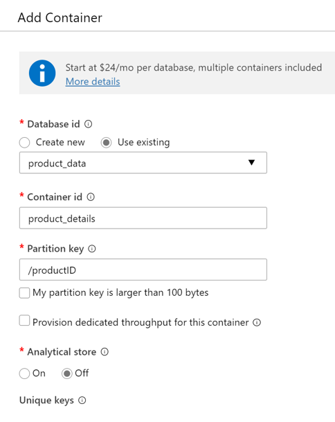

# Deployment Guide  
  
We are currently working on an automated deployment process for this solution accelerator. Until this becomes available, here is the Manual Deployment Guide for deploying this Solution Accelerator.  

## Step 1: Get the data required for this Accelerator 
We are using the data provided by [this Kaggle Open Dataset](https://www.kaggle.com/mkechinov/ecommerce-behavior-data-from-multi-category-store), and you will need to download the data to your local machine. You will need the following CSVs/Datasets (download them):  
    - 2019-Oct.csv  
    - 2019-Nov.csv  
    - 2019-Dec.csv.gz (available [here](https://drive.google.com/drive/folders/1Nan8X33H8xrXS5XhCKZmSpClFTCJsSpE))   
    - 2020-Jan.csv.gz (available [here](https://drive.google.com/drive/folders/1Nan8X33H8xrXS5XhCKZmSpClFTCJsSpE))  


## Step 2: Create Azure Synapse Analytics (workspace preview)
In this step you will deploy an Azure Synapse Analytics (workspace preview) and a Spark Pool in the Azure Synapse Analytics (workspace preview), an Azure Data Lake (Gen2) Storage Account and a Cosmos DB Account into your Azure Subscription that you are using for this solution accelerator. 


**Parameters**

Below are paramaters you will use to create the necessary resources for this solution accelerator. 
- **Subscription**: Azure Subscription Id 
- **Resource Group**: Name of the resource group to create 
- **Resource Name**: a globally unique name for creating the resources (must be 3-10 characters)
- **Username**: SQL user for Synapse workspace 
- **Password**: SQL user for Synapse workspace (must be at least 8 characters)
- **Location**: the location to deploy all the resources  
- **Directory Path**: the directory path where the dataset is located locally on your computer  
- **Cosmos DB Account Name**: the name of the Cosmos DB Account that will be used to store the User Recommendations and Product Details  


**Note:** You will be installing the Azure CLI extension for Azure Synapse 
1. Open Powershell as Administrator  
2. Navigate to this folder `Resource Deployment\deployment\backend\`  
3. Run the following command: 
    `./deployment_script.ps1`

### Step 2.1: Storage Account Permisions 
In order to read files from your Azure Storage Account from the Azure Synapse Workspace, you will need to grant `Storage Blob Data Contributor`. Follow the steps below to assign Storage Blob Data Contributor to the users. 
1. Go to the Azure Data Lake Storage Account created in Step 2
2. Go to the `Access Control (IAM)` 
3. Click "+ Add"
4. Click "Add role assignment" 
5. Now click the Role dropdown and select `Storage Blob Data Contributor` and search for your username and the other user's usernames to be added by using the search bar. 
6. Click "Save" at the bottom 

### Step 2.2: Upload Additional Dataset 
We use the [`product_details.json`](../Analytics_Deployment/data/product_detail.json) to enhance the products served to the front-end with image information and cleaned up names.  

1. Upload this JSON to the Azure Data Lake Storage Account attached to your Synapse Studio  
    - Make sure you put it into the filesystem that is the Primary Filesystem for the Synapse Studio  
    - Put it in the folder `synapse/workspaces` in the filesystem that is the primary filesystem for the Synapse Studio
2. Import [`Analytics Deployment\synapse-studio\notebooks\01_CreateOrUpdateProductDetails.ipynb`](../Analytics_Deployment/synapse-studio/notebooks/01_CreateOrUpdateProductDetails.ipynb) to the Synapse Studio and fill out the parameters for the filesystem name and the account name  
3. Execute the Notebook  

## Step 3: Upload Assets and Data to the Synapse Workspace  
1. Launch the Synapse Studio:  
    - Go to the resource page in the portal and click the "Launch Synapse Studio"
2. Go to "Develop", click the "+", and click Import:  
    - In the demo's repository, go to `Analytics Deployment\synapse-studio\notebooks` to select all of the the Spark Notebooks  
3. Click Publish and confirm the assets to be published  
4. Go to the "Manage" tab in the Studio and click on the Apache Spark pools  
5. Click on the Spark Pool that you deployed and click "Packages, then click "Upload environment config file"  
    - Go to `Analytics Deployment\synapse-studio\cluster_config` to get the requirements.txt for upload  
6. Ensure that you give yourself and any other user admin privilages for this accelerator by going to the `Manage` tab, then `Access control` underneath `Security` and click "+ Add"
    -   
7. Now click the Role dropdown and select all three roles, and search for your username and the other user's usernames to be added by using the search bar underneath the Role dropdown  
    -   
    -   
8. Click Apply at the bottom of the window.  
9. Now the environment should be ready to go for the execution of the scripts  
  
## Step 4: Setting Up the Cosmos DB and Azure Synapse Link  
### Create Containers for Recommendations and Product Details  
1. Go to the Cosmos DB service that was created in Step 2  

2. Go to the Data Explorer and create a database named `product_data` with the configurations below  
    - 

3. Underneath the database, create two containers with the following configurations  
    -   
    -  

4. Follow the directions [here](https://docs.microsoft.com/en-us/azure/synapse-analytics/synapse-link/how-to-connect-synapse-link-cosmos-db#connect-an-azure-cosmos-db-database-to-a-synapse-workspace) to link your Cosmos DB to your Azure Synapse Analytics Workspace  
    - **NOTE**: Make sure to create a Linked Service in Synapse for the Cosmos DB connection and name it `retail_ai_cosmos_synapse_link`  

## Step 5: Running of the Notebooks and SQL Scripts  
1. Go to the Azure Portal and deploy a Azure Machine Learning Services resource into the resource group that you are using for this Solution Accelerator.  
    - You can search for `Machine Learning` after clicking on `Create a resource` to get the correct resource.  
    - **NOTE**: Along with the service comes the following:  
        - Azure Key Vault  
        - Azure Storage  
        - Azure Application Insights  
        - Azure Container Registry (**ATTENTION**: The name of this service will be needed in the deployment of the Azure Kubernetes Service)  
            - You can find the name of the associated Container Registry in the resource page of the deployed Azure Machine Learning Service  

2. Now you will need to create a Service Principal and give Contributor access to the Azure Machine Learning Service. Run the following commands in the Powershell: 
- **Note**:Save the client-id and password of this Service Principal for future steps in the [Notebook](../Analytics_Deployment/synapse-studio/notebooks/03_ALS_Model_Training.ipynb). This will install the Azure Machine Learning CLI Extention. 


```sh 
#After running the script, it will propt you to login to the portal or enter a device code. 
az login

#Install the Azure Machine Learning CLI Extention 
az extension add -n azure-cli-ml

# Set the subscription you will be using for this solution accelerator
# NOTE: you will need to replace the following 
# - <subscription-id>
az account set --subscription <subsciption-id>

# Create a Service Principal
# NOTE: you will need to replace the following 
# - <service-principal-name>: Desired name for the serive principal
az ad sp create-for-rbac --sdk-auth --name <service-principal-name>

# Get details of your service principal 
# NOTE: you will need to replace the following
# - <client-id>: the client id from the previous step
az ad sp show --id <client-id> 

# Assign contributor role to the Azure Machine Learning Service 
# NOTE: you will need to replace the following
# - <workspace-name>: Azure Machine learning workspace name
# - <resource-group>: name of the resource group used for this solution accelerator 
# - <object-id>: the object id of the service principal 
az ml workspace share -w <workspace-name> -g <resource-group> --user <object-id> --role contributor
```

3. Configure / Fill out the Parameters and then Run the following notebooks and scripts in order:  
    - [`02_Clean_Training_Data.ipynb`](../Analytics_Deployment/synapse-studio/notebooks/02_Clean_Training_Data.ipynb)  
    - [`03_ALS_Model_Training.ipynb`](../Analytics_Deployment/synapse-studio/notebooks/03_ALS_Model_Training.ipynb)  
    - [`04_RecommendationRefresh.ipynb`](../Analytics_Deployment/synapse-studio/notebooks/04_RecommendationRefresh.ipynb)
    
4. After all of these have been run successfully, the recommendations will have been generated for the User-Based Recommendations, and the model will be ready for deployment for the Item-Based Recommender served on Azure Kubernetes Service.  
  
## Step 6: Set Up the Item-Based Recommendation Web Service  
> In this section we will set up the Item-Based Recommendation Web Service by using Azure Machine Learning Service to package and deploy the model and Azure Kubernetes Service to host the model. 

> You will need Python 3.7+ installed on your local mahcine.  
 
1. Launch the Azure Machine Learning Studio: 
    - Go to the resource page in the portal and click the "Launch Studio" 
2. Go to "Compute", click "Inference Clusters" and click "+ New": 
    - fill in the Compute Name, Region, choose the Dev-test or Production for the cluster purpose and select Create

3. In the repository on your local machine, open `Analytics Deployment\amls\model_deployment\` in an IDE like VS Code  
4. Run `pip install -r requirements.txt`  
5. Edit the `download_model.py` file:  
    -  In the file `download_model.py`, edit the following:  
        ```python
        # Enter the name of the Azure Data Lake Storage Gen2 Account
        DATA_LAKE_NAME=""
        # Enter the name of the filesystem
        DATA_LAKE_FILE_SYSTEM_NAME=""
        # Enter the Primary Key of the Data Lake Account
        DATA_LAKE_PRIMARY_KEY=""
        ```  
    - Now run `python download_model.py`  
        - This should create a ZIP of the model on your local machine.  
6. Before deploying the model, edit the `score.py` file and the `deploy_model.py` file.  
    - `score.py` at the top of the file in the `init()` function:   
        ```python
        def init():
            ## Add in your Data Lake Details Here
            
            ## The DATA_LAKE_NAME should be the attached Data Lake to your Synapse Studio where the saved ALS Model is
            DATA_LAKE_NAME=""
            ## DATA_LAKE_FILE_SYSTEM_NAME should be the filesystem that is attached to the Synapse Studio where the Model is saved
            DATA_LAKE_FILE_SYSTEM_NAME=""
            ## DATA_LAKE_PRIMARY_KEY is the Primary Key of the Azure Data Lake Storage Gen2 that can be found in the portal
            DATA_LAKE_PRIMARY_KEY=""
        ```  
    - `deploy_model.py`  
        ```python
        # Subscription ID for the Solution Accelerator
        SUBSCRIPTION_ID=""
        # Resource Group that you are using for the Solution Accelerator
        RESOURCE_GROUP=""
        # Found in the output of the Service Principal created earlier
        TENANT_ID=""
        # Found in the output of the Service Principal created earlier
        APP_ID=""
        # Found in the output of the Service Principal created earlier
        SP_PASSWORD=""
        # Name of the Azure Machine Learning Service that you deployed
        WORKSPACE_NAME=""
        # Name of the Azure Kubernetes Service that you deployed
        AKS_CLUSTER_NAME=""
        ```  
7. Now run `python deploy_model.py` and the model will be registered with AMLS and deployed to the AKS cluster  
    
## Step 7: Setting Up the API Infrastructure  
### Set Up Azure API Management  
1. Navigate to the [Application_Backend_Deployment](../Application_Backend_Deployment/README.md) and follow the steps to deploy the API endpoints.
2. Deploy Azure API Management in the resource group that you are using for this Solution Accelerator  
2. In the Azure API Management, go to `APIs` and choose `Blank API` 
4. Configure the name of your API and click Create  

> Now you are ready to integrate the API with your front-end by utilizing the API you built in Azure API Managment.  
  
#### Example Recommendation Call  

```https://{ENTER_YOUR_APIM_NAME}.net/{VERSION_NUM_OF_API}/get_shopper_recommendations?subscription-key={APIM_SUBSCRIPTION_KEY}&user_id=568778435```

# Step 8: Setting Up the Event Hub 
1. Run the following commands in Powershell to deploy an Event Hub Namespace and Event Hub into the resource group you are using for this solution accelerator. 

    ```sh 
    # Set your Azure subscription to the subscription used in this solution accelerator
    
    # NOTE: you will need to replace the following: 
    # - <Subscription-Id>
    az account set --subscription <Subscription-Id>

    # Create Event Hub namespace 

    # NOTE: you will need to replace the following: 
    # - <event-hub-namespace>, <resourse-group>, <location>
    az eventhubs namespace create --name <event-hub-namespace> --resource-group <resource-group> -l <location>

    # Creat Event Hub called clickthrough

    # NOTE: you will need to replace the followng: 
    # - <resource-group>, <event-hub-namespace>
    az eventhubs eventhub create --name clickthrough --resource-group <resource-group> --namespace-name <event-hub-namespace>
    ```
2. Navigate to the Event Hub Overview in the Azure portal
    - From the Overview, go to `Event Hubs`, click the `clickthrough` Event Hub created in the previous step
    - Click `Capture events` to turn on and configure the settings to send events to the storage account you are using for this solution accelerator.  
3. Navigate to the `clickthrough` Event Hub and click `Shared access policies`, click "+ Add" and configure a new policy and click `send`. 
    - Click `Create`
4. Navigate to the [Application_Frontend_Deployment/contoso-retail/src/config.ts](../Application_Frontend_Deployment/contoso-retail/src/config.ts) to add the `EVENT_HUB_ACCESS_KEY`, `EVENT_HUB_KEYNAME`, and `EVENT_HUB_NAMESPACE` created in the previous steps to the application. 
